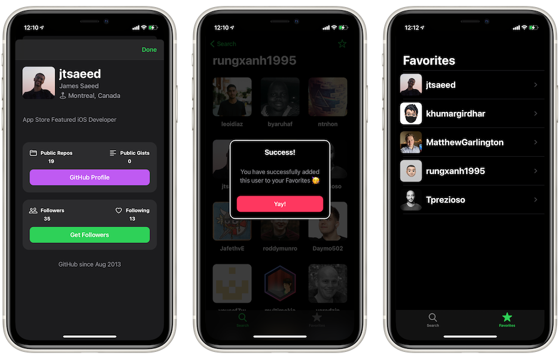

# GHFollowers
## About
This is the project that centers around [Sean Allen](https://seanallen.co)’s Take Home Project to transform GitHub’s API into meaningful data for users.

The code has adopted contributions in the course’s comment section from several iOS developers where they made more sense; therefore it is not 100% similar to that provided by the instructor.

## Screenshots

## Course Link
Click [here](https://seanallen.teachable.com/p/take-home) to check out the course.

## Concepts Utilized
* `Programmatic AutoLayout`
* `MVC`-Oriented
* `Delegate` protocols
* Custom views
* `UITabBarController`
* `UINavigationController`
* `Modal` Presentation
* `Networking`
* `UserDefaults`
* `SearchController`
* Diffable Data Source
* `UICollectionView`
* `UIScrollView`